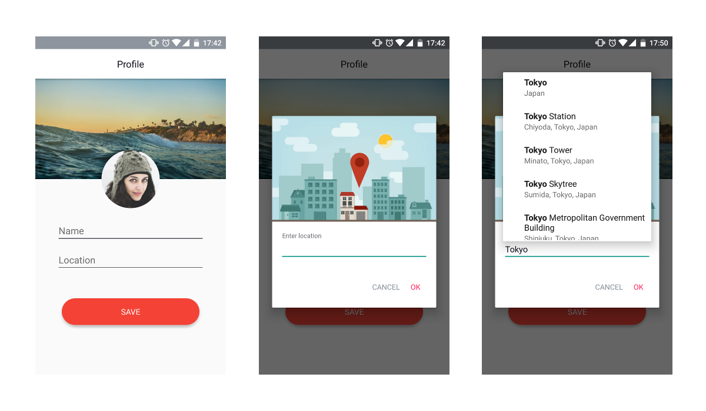

Place Search Dialog
==========
A place autocomplete search dialog which uses Google's places API for finding results.



The dialog searches from locations all around the world by default. To customize it, set the new location bounds using ```.setLatLngBounds(BOUNDS)```
PlaceSearchDialog requires Places API key by Google. You can get it from 

##How to use

Use the dialog as it is
```java
 PlaceSearchDialog placeSearchDialog = new PlaceSearchDialog.Builder(this)
                .setLocationNameListener(new PlaceSearchDialog.LocationNameListener() {
                    @Override
                    public void locationName(String locationName) {
                        //set textview or edittext
                    }
                })
                .build();
placeSearchDialog.show();
```

or Customize it accordingly
```java
 PlaceSearchDialog placeSearchDialog = new PlaceSearchDialog.Builder(this)
                .setHeaderImage(R.drawable.dialog_header)
                .setHintText("Enter location name")
                .setHintTextColor(R.color.light_gray)
                .setNegativeText("CANCEL")
                .setNegativeTextColor(R.color.gray)
                .setPositiveText("SUBMIT")
                .setPositiveTextColor(R.color.red)
                .setLatLngBounds(BOUNDS)
                .setLocationNameListener(new PlaceSearchDialog.LocationNameListener() {
                    @Override
                    public void locationName(String locationName) {
                        //set textview or edittext
                    }
                })
                .build();
placeSearchDialog.show();
```

Add this in your applications AndroidManifest.xml
```xml
<meta-data android:name="com.google.android.geo.API_KEY"
            android:value="YOUR_API_KEY" />
```

##Installation

###Gradle
Just use it as a dependency in your app's build.gradle file

```groovy
dependencies {
    compile 'com.codemybrainsout.placesearchdialog:placesearch:1.0.1'
}
```

###Maven
Ensure you have android-maven-plugin version that support aar archives and add following dependency:

```xml
<dependency>
  <groupId>com.codemybrainsout.placesearchdialog</groupId>
  <artifactId>placesearch</artifactId>
  <version>1.0.0</version>
  <type>pom</type>
</dependency>
```

##Credits

This project was initiated by **Code My Brains Out**. You can contribute to this project by submitting issues or/and by forking this repo and sending a pull request.


Follow us on:

[](https://www.facebook.com/codemybrainsout)&nbsp;&nbsp;&nbsp;&nbsp;&nbsp;[](https://twitter.com/codemybrainsout)

Author: [Rahul Juneja](https://github.com/ahulr)

#License
```
Copyright (C) 2016 Code My Brains Out

Licensed under the Apache License, Version 2.0 (the "License");
you may not use this file except in compliance with the License.
You may obtain a copy of the License at

http://www.apache.org/licenses/LICENSE-2.0

Unless required by applicable law or agreed to in writing, software
distributed under the License is distributed on an "AS IS" BASIS,
WITHOUT WARRANTIES OR CONDITIONS OF ANY KIND, either express or implied.
See the License for the specific language governing permissions and
limitations under the License.
```
